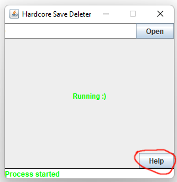
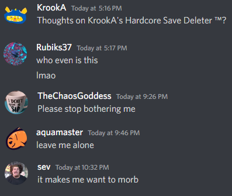

# Subnautica Hardcore Save Deleter
I really really hate deleting hardcore saves while speedrunning subnautica. Massive PITA. 

Have you ever thought to yourself "wow instead of deleting these saves I could be spending my time doing something more productive like getting a gf or going to see my kids, but unfortunately there's no automated program to do this so I guess I gotta sit here and delete them"? Well then YOU'RE IN LUCK BUCKO!

Simply click "Releases" on the right there (==>) then find the newest release (probably the one at the very top). Click on Hardcore.Save.Deleter.jar to download the program, then save it where you would like. I would recommend putting it somewhere convenient like in your livesplit folder. Java runtime is required for use.

For help on how to use the app there's a "help" button you can click in the app that gives more detailed instructions. 

I guarentee this will not only save countless seconds if you're a hardcore speedrunner, but is also scientifically proven to make you a happier person and have a more attractive personality (scientific tests are inconclusive). 

### Some statements by satisfied users:

### So that's that
Thanks for reading this readme and sorry for any physical pain it caused you. If there are any issues not solved by the "help" section inside the app be sure to give me a DM on discord. If there's an error somewhere feel free to open a PR if you feel like fixing it. Hope this makes your hardcore speedrunning experience less painful and removes the minor inconvenience.

